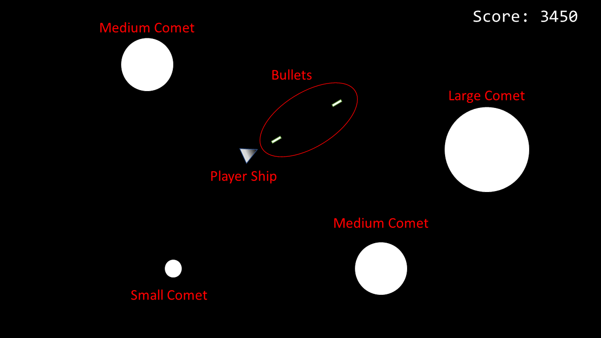
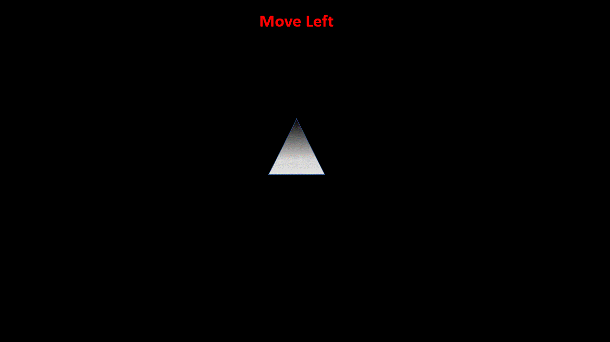
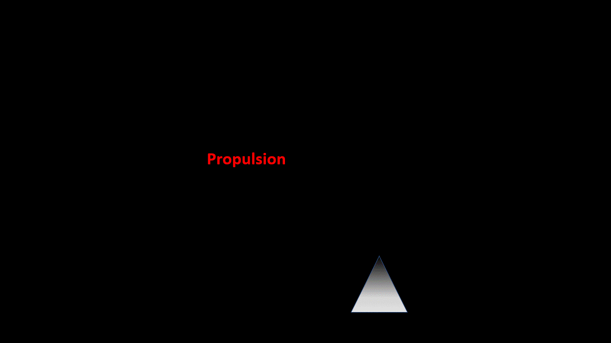
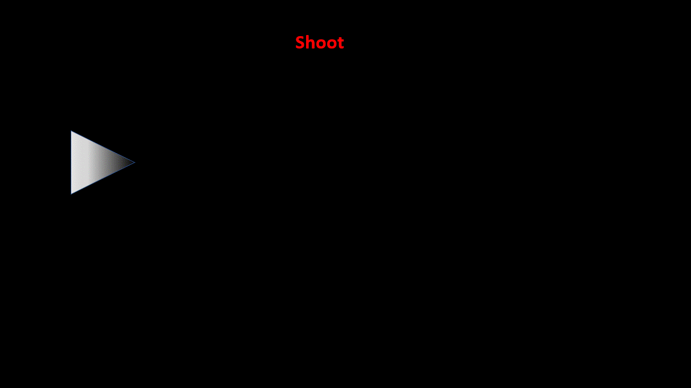
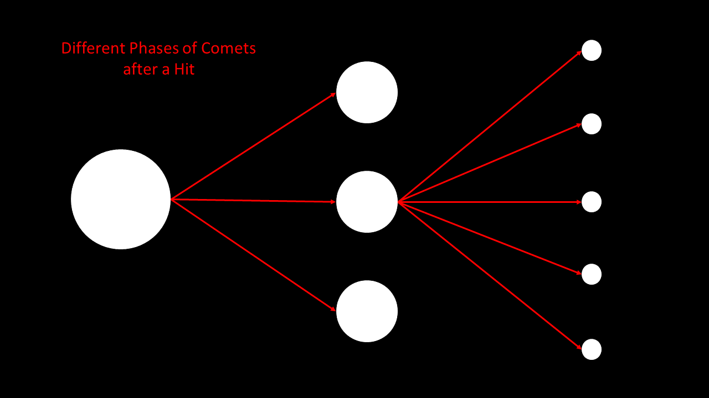

# Projeto Fundamentos de Programação 2022/2023

## Introdução 
Todos os grupos devem implementar em Python um jogo chamado *Comets*. Este jogo necessita **obrigatóriamente** interface gráfica em PyGame.

## Contexto do Jogo
O jogo *Comets* é uma recriação do classico jogo [*Asteroids*](https://www.youtube.com/watch?v=WYSupJ5r2zo) onde o jogador controla uma nave num plano 2D onde o objetivo é destruir o maior número de cometas possível enquanto tenta evitá-los.

### Objectivo do Jogo
O objetivo do jogo é destruir o maior numero de cometas que aparecem no ecrã. Se um cometa colidir com a nave do jogador este é destruído. O jogador tem apenas **1 vida**, ou seja se o jogador é destruído é imediatamente **game over**.

### Gameplay

O jogador controla uma nave num plano 2D usando as setas e a tecla **space** (ou espaço) do teclado. 

A interface principal é estática (não se mexe) onde apenas os objectos (i.e. a nave e os cometas) se movem no plano 2D. Este plano é um ecrã 800x600 (ou seja 800 Width e 600 Height).

Existe um sistema de pontos que incrementa com base no numero de cometas destruídos. Cometas são representados por circulos enquanto a nave do jogador é um triangulo. Para a nave do jogador é necessário definir uma das arestas deste triangulo como a *frente* da nave enquanto as outras duas são a *traseira*. **Será da frente do triangulo que o jogador dispara.**

#### Controlar a Nave

Todo o movimento da nave é feita com o teclado, usando as setas e a tecla espaço para disparar.  

As setas para a direita e para a esquerda fazem uma rotação fixa da nave.

A seta *Up* aplica uma força de propulsão na direção onde a nave está apontada, esta força tem uma aceleração ao qual fica zero após atingir um valor constante. É importante realçar que não existe *travão*, ou seja para reduzir a velocidade da nave este tem que fazer propulsão no sentido contrário do seu deslocamento corrente.  

A tecla *espaço* (ou spacebar) dispara uma bala na direção ao qual a nave está apontada com uma velocidade constante. A frequência de disparo é **obrigatóriamente** de 1 em 1 segundo. 

A bala é destruída consoante estas condições:
	- Colide com um cometa
	- Passou o tempo limite de *vida* que são 4 segundos

#### Mecânicas dos Cometas

Existem 3 estilos de cometas diferentes: Grande, Medio e Pequeno. O Cometa inicializa **sempre** como grande e após a ser distruído este multiplica-se para um tipo diretamente abaixo, ou seja um cometa passa de grande para medio, de médio para pequeno e após ser atingido em pequeno é completamente distruído.

Quando um cometa é atingido por uma bala dependendo do seu tipo, pode multiplicar-se em cometas de um tipo abaixo, ou seja:
	
	- Cometa Grande -> 3 $\times$ Cometa Medio
	- Cometa Medio -> 5 $\times$ Cometa Pequeno
	- Cometa Pequeno -> Destroy

## Objetivos e Critério de Avaliação

Este projeto tem os seguintes objetivos:

-   **O1** - Programa deve funcionar como especificado. Atenção aos detalhes, pois é fácil desviarem-se das especificações caso não **leiam o enunciado com atenção**.
-   **O2** - Projeto e código bem organizados, nomeadamente:
    -   Código devidamente comentado e indentado.
    -   Inexistência de código "morto", que não faz nada, como por exemplo variáveis, propriedades ou métodos nunca usados.
    -   Projeto compila e executa sem erros e/ou _warnings_.
-   **O3** - Projeto adequadamente documentado com *comentários* descrevendo a funcionalidade de várias secções do código.
-   **O4** - Repositório Git deve refletir boa utilização do mesmo, nomeadamente:
    -   Devem existir _commits_ de todos os elementos do grupo, _commits_ esses com mensagens que sigam as melhores práticas para o efeito (como indicado [aqui](https://chris.beams.io/posts/git-commit/), [aqui](https://gist.github.com/robertpainsi/b632364184e70900af4ab688decf6f53), [aqui](https://github.com/erlang/otp/wiki/writing-good-commit-messages) e [aqui](https://stackoverflow.com/questions/2290016/git-commit-messages-50-72-formatting)).
    -   Ficheiros binários não necessários, não devem estar no repositório. Ou seja, devem ser ignorados ao nível do ficheiro `.gitignore`.
-   **O5** - Relatório em formato [Markdown](https://guides.github.com/features/mastering-markdown/) (ficheiro `README.md`), organizado da seguinte forma:
    -   Título do projeto.
    -   Autoria:
        -   Nome dos autores (primeiro e último) e respetivos números de aluno.
        -   Informação de quem fez o quê no projeto. Esta informação é **obrigatória** e deve refletir os _commits_ feitos no Git.
        -   Indicação do repositório Git utilizado. Esta indicação é opcional, pois podem preferir manter o repositório privado após a entrega.
    -   Arquitetura da solução:
        -   Descrição da solução, com breve explicação de como o código foi organizado, bem como dos algoritmos não triviais que tenham sido implementados.
    -   Referências, incluindo trocas de ideias com colegas, código aberto reutilizado (e.g., do StackOverflow) e bibliotecas de terceiros utilizadas. Devem ser o mais detalhados possível.
    -   **Nota:** o relatório deve ser simples e breve, com informação mínima e suficiente para que seja possível ter uma boa ideia do que foi feito. Atenção aos erros ortográficos e à correta formatação [Markdown](https://guides.github.com/features/mastering-markdown/), pois ambos serão tidos em conta na nota final.

O projeto tem um peso de 5 valores na nota final da disciplina e será avaliado de forma qualitativa. Isto significa que todos os objetivos têm de ser parcialmente ou totalmente cumpridos. A cada objetivo, O1 a O5, será atribuída uma nota entre 0 e 1. A nota do projeto será dada pela seguinte fórmula:

_N = 10 x O1 x O2 x O3 x O4 x O5_

Em que _D_ corresponde à nota da discussão e percentagem equitativa de realização do projeto, também entre 0 e 1. Isto significa que se os alunos ignorarem completamente um dos objetivos, não tenham feito nada no projeto ou não comparecerem na discussão, a nota final será zero.

### Requisito Mínimo do Projeto

### Pontuação Extra

**Importante**: Façam o minimo requerido primeiro antes de tentarem fazer mais funcionalidades!

## Entrega
O projeto deve ser entregue por **grupos de 2 alunos** via Moodle até às **23:59** do dia **23 de Dezembro 2022**. Um (e apenas um) dos elementos do grupo deve ser submeter um ficheiro `zip` com a solução completa, nomeadamente:

-   Pasta escondida `.git` com o repositório Git local do projeto.
-   Pasta do projeto, contendo os ficheiros todos deste.
-   Ficheiro `README.md` contendo o relatório do projeto em formato [Markdown](https://guides.github.com/features/mastering-markdown/).
-   Ficheiro de imagem contendo o Fluxograma. Este ficheiro deve ser incluído no repositório em modo Git LFS.
-   Outros ficheiros de configuração, como por exemplo `.gitignore` e `.gitattributes`.

**Não serão avaliados projetos sem estes elementos e que não sejam entregues através do Moodle.**

## Honestidade académica
Nesta disciplina, espera-se que cada aluno siga os mais altos padrões de honestidade académica. Isto significa que cada ideia que não seja do aluno deve ser claramente indicada, com devida referência ao respectivo autor. O não cumprimento desta regra constitui plágio.

O plágio inclui a utilização de ideias, código ou conjuntos de soluções de outros alunos ou indivíduos, ou quaisquer outras fontes para além dos textos de apoio à disciplina, sem dar o respectivo crédito a essas fontes. Os alunos são encorajados a discutir os problemas com outros alunos e devem mencionar essa discussão quando submetem os projetos. Essa menção **não** influenciará a nota. Os alunos não deverão, no entanto, copiar códigos, documentação e relatórios de outros alunos, ou dar os seus próprios códigos, documentação e relatórios a outros em qualquer circunstância. De facto, não devem sequer deixar códigos, documentação e relatórios em computadores de uso partilhado, e muito menos usar repositórios Git públicos (embora os mesmos possam ser tornados públicos 12h após a data limite de submissão).

Nesta disciplina, a desonestidade académica é considerada fraude, com todas as consequências legais que daí advêm. Qualquer fraude terá como consequência imediata a anulação dos projetos de todos os alunos envolvidos (incluindo os que possibilitaram a ocorrência). Qualquer suspeita de desonestidade académica será relatada aos órgãos superiores da escola para possível instauração de um processo disciplinar. Este poderá resultar em reprovação à disciplina, reprovação de ano ou mesmo suspensão temporária ou definitiva da ULHT.

_Texto adaptado da disciplina de [Algoritmos e Estruturas de Dados](https://fenix.tecnico.ulisboa.pt/disciplinas/AED-2/2009-2010/2-semestre/honestidade-academica) do [Instituto Superior Técnico](https://tecnico.ulisboa.pt/pt/)_

## Licenças
Este enunciado é disponibilizado através da licença [CC BY-NC-SA 4.0](https://creativecommons.org/licenses/by-nc-sa/4.0/).

## Metadados
-   Autores: [Phil Lopes](https://github.com/worshipcookies) e [Diogo Andrade](https://github.com/DiogoDeAndrade)
-   Curso: [Licenciatura em Videojogos](https://www.ulusofona.pt/licenciatura/videojogos)
-   Instituição: [Universidade Lusófona de Humanidades e Tecnologias](https://www.ulusofona.pt/)

